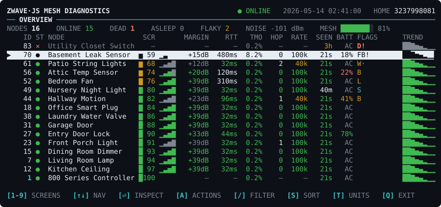
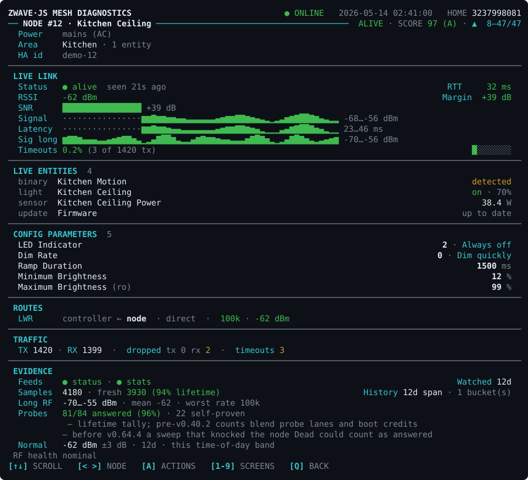
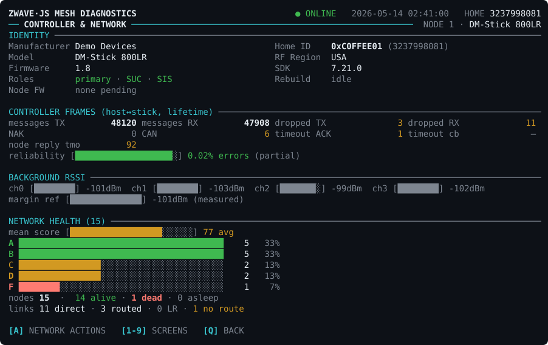
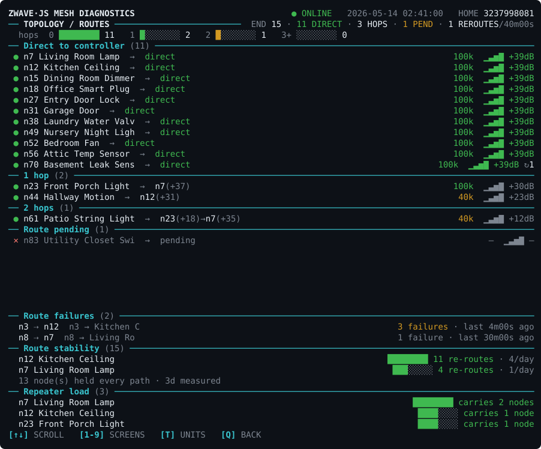
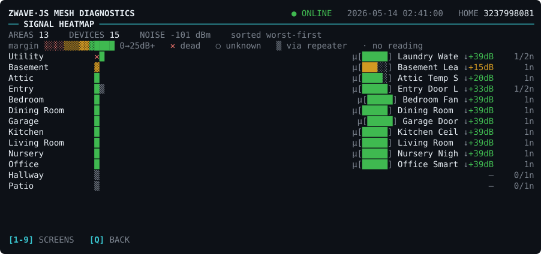
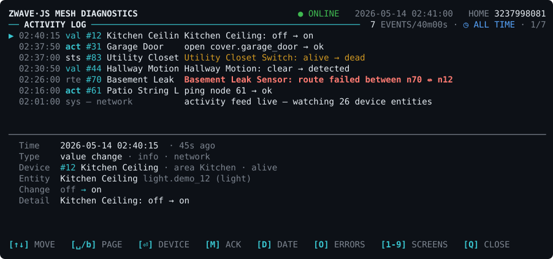
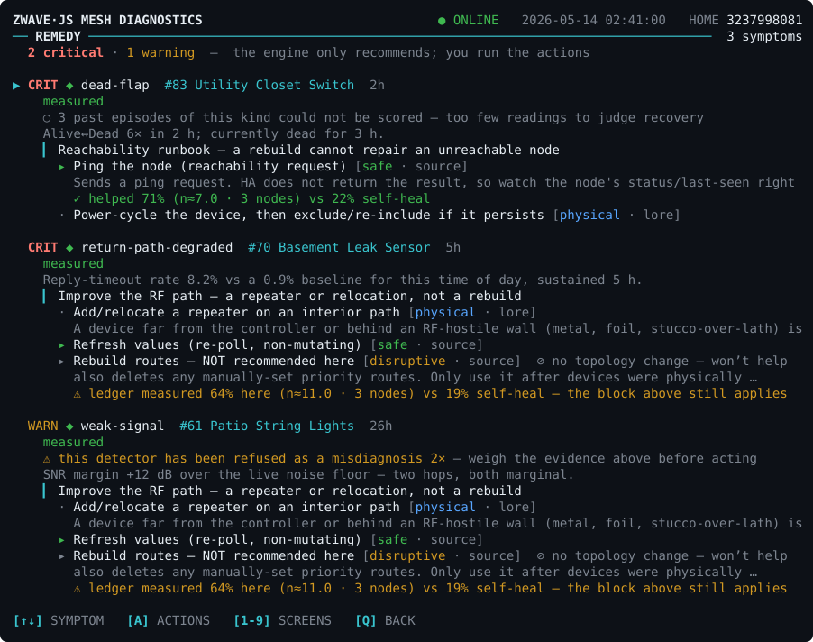
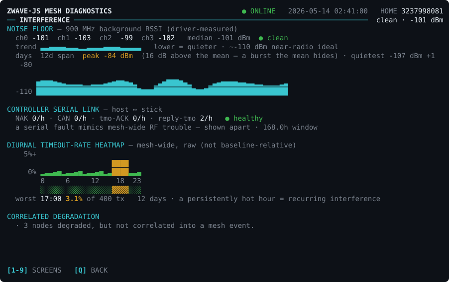
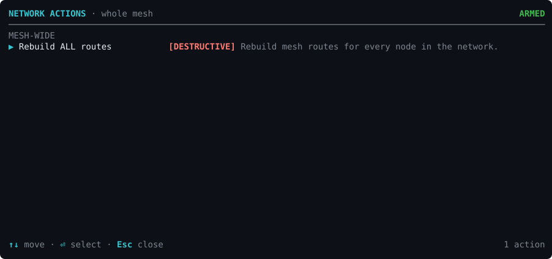

# Z-Wave TUI

A telnet **control-room terminal UI** for a Home Assistant Z-Wave JS mesh — and a
**learned remediation engine** that watches that mesh over time, learns each
node's normal, and turns anomalies into grounded, ranked recommendations.
Recommendations are never acted on automatically; the one autonomous write is
the opt-in, off-by-default **auto-ping** (see *Write actions & safety*).

It talks to the **Home Assistant Core WebSocket** (the node roster, live
statistics, and — behind a typed confirmation — maintenance, device-control, and
config-write actions) and, strictly read-only, to the **Z-Wave JS driver WebSocket**
for the real background-noise
floor and capability flags that HA does not expose. It persists a per-node
evidence time-series, scores every node worst-health-first, detects mesh symptoms,
and recommends fixes — across **eight screens**, over a telnet server and a
browser console.



**One engine, two front doors:**

- **Telnet** on port `2324` — a full-screen terminal on your LAN.
- **Browser console** in the Home Assistant sidebar (HA Ingress) — works inside
  the HA mobile app, no extra ports exposed.

The Home Assistant add-on — including the Node/TypeScript server — lives in
[`./zwave_tui`](./zwave_tui); the server source is under
[`./zwave_tui/server`](./zwave_tui/server). Everything the image needs sits
inside `zwave_tui/` — CI builds the multi-arch image from that one directory,
and installs pull it from GHCR.

> **Works with any Z-Wave JS network.** Nothing about a specific controller or
> mesh is hard-coded: the `zwave_js` config-entry id is **auto-discovered** at
> startup and the node roster comes from the device/entity registries. Developed
> and tested against a Zooz ZST39 LR 800-series controller on a ~39-node mesh.

## The advisory engine

Beyond the live dashboard, the engine runs a pipeline that turns raw statistics
into diagnoses and recommendations — **advisory, everything grounded in
measured evidence:**

1. **Evidence store** — a persistent per-node time-series on `/data` (a fine ring
   plus a downsampled multi-day coarse tier), with fabrication guards so a counter
   reset or a quiet window never invents a reading. Survives restarts.
2. **Baselines** — each node's "normal" is learned per time-of-day band across
   several distinct days before its detectors may fire; symptomatic windows are
   quarantined so a fault can't teach the baseline to accept itself.
3. **Symptom detectors** — degraded return path, dead-flapping, rate fallback,
   high RTT, weak signal, **route churn** (the mesh cannot settle on a stable
   path — usually one marginal repeater), a chatty flooder, a suspected ghost,
   controller serial-link strain, **S2 nonce-resync storms** (a marginal *secure*
   link, which no statistics counter can see — it is read from the driver's own
   log stream),
   and correlation across nodes: an **edge-cluster** (a small group sharing one
   repeater) and a mesh-wide interference event, which *subsume* the per-node
   symptoms beneath them so you see one cause, not N faults.
   A detector only fires while the condition is *still happening* — a burst that
   ends de-asserts rather than maturing into a "persistent" symptom.
4. **Planner** — each symptom becomes a ranked set of recommendations: physical
   guidance first (most Z-Wave fixes are physical — move a repeater, power-cycle,
   relocate the stick) plus any safe executable probe. Safety gates fail closed;
   a route rebuild is only ever shown to say *not* to.
5. **Outcome learning** — when a symptom resolves, the engine records whether the
   action beat the mesh's own spontaneous-recovery rate, scored per symptom kind
   by the signal its fix actually moves. It only claims an action "helped" once it
   clears that control arm by a real margin.
6. **Interference watch** — the real 900 MHz noise floor (recovered from the
   driver WebSocket, since HA strips it), controller serial-link health shown
   apart, a diurnal timeout heatmap, and a persisted multi-day noise-floor trend.

**Read-only by default.** Every operator action is human-gated behind a typed
`CONFIRM`; the engine's recommendations are never self-executed. The one
autonomous write — the opt-in **auto-ping** probe — is documented in
[Write actions & safety](#write-actions--safety).

## Screens & keys

The **Overview** node list is home; every other screen is an overlay that
dismisses with `q` / `Esc`.

| # | Screen | What it shows |
| --- | --- | --- |
| 1 | **Overview** | Live node table, worst-health-first, summary bar + per-node flags. |
| 2 | **Detail** | Scrollable per-node dossier: identity, live link, **live entity state** (is the light on? sensor values, lock state, climate mode…), the device's **Z-Wave configuration parameters**, LWR/NLWR routes, TX/RX reliability, battery, firmware. |
| 3 | **Controller** | Node-1 radio health, background-RSSI noise floor, controller counters, rebuild progress. |
| 4 | **Topology** | Hop-grouped route tree + repeater load + Long-Range star. |
| 5 | **Heatmap** | Nodes by HA area, cells graded by SNR-margin bucket. |
| 6 | **Log** | Driver/value/notification events + command outcomes; scroll, filter; error events latch red so they cannot scroll away unseen. |
| 7 | **Remedy** | The engine's diagnoses + ranked recommendations, with learned "helped X%" efficacy. |
| 8 | **Interference** | Noise floor + recent/multi-day trend, serial-link health, diurnal timeout heatmap. |

**Keys.** `1`–`8` jump to a screen (`c` Controller, `e` Log, `y` Remedy, `f`
Interference are shortcuts too). On Overview: `j`/`k` move, `Enter` detail, `/`
filter, `s` sort, `t` margin↔dBm. `a` opens the **Actions Menu** for the selected
node (on the Controller screen it opens the **mesh-wide** actions instead);
`p` pings the selected node (gated); `q` quits.

**Detail** is the per-node dossier — it scrolls, and answers both *"what is this
device doing right now?"* and *"how is it configured?"*:



<details>
<summary><b>The other six screens</b> — Controller, Topology, Heatmap, Log, Remedy, Interference</summary>

#### Controller — radio health, noise floor, counters


#### Topology — hop-grouped route tree


#### Heatmap — nodes by area, graded by SNR margin


#### Log — driver events, value changes, command outcomes


#### Remedy — diagnoses and ranked recommendations


#### Interference — noise floor, serial health, diurnal heatmap


</details>

> Screenshots are generated from a **synthetic demo mesh** by
> [`zwave_tui/server/scripts/gen-screenshots.mts`](./zwave_tui/server/scripts/gen-screenshots.mts) —
> regenerate them with `cd zwave_tui/server && npx tsx scripts/gen-screenshots.mts`.

Full keybinding and screen documentation is in
[`zwave_tui/DOCS.md`](./zwave_tui/DOCS.md) — the complete System & Engine
Reference (also attached to each [release](https://github.com/tesseractAZ/zwave/releases)
as `.docx` + `.pdf`).

## Health score

A composite **0–100** score + letter grade + discrete state, blending weighted
lanes — reachability, signal margin over the *live* noise floor + SNR, route
quality, TX reliability, interview — with hard gates: **dead → 0**, **unknown**
capped low, a node **asleep within its wake interval is not penalized**, and
**battery is a separate advisory lane** that never drags down the RF score.
Long-Range nodes (id ≥ 256) redistribute route weight into signal + reliability.
The TX-reliability signal is the reply-timeout rate (`timeoutResponse / commandsTX`),
not `commandsDroppedTX` — which does not count RF ACK failures.

Grade bands: **A** ≥ 90, **B** ≥ 80, **C** ≥ 70, **D** ≥ 55, **F** < 55.

Flags: `D` dead · `S` stale · `W` weak signal · `F` response timeouts · `R` route
problem · `L` high latency · `I` incomplete interview · `B` battery low ·
`U` firmware update available (advisory — never affects the score).

## Write actions & safety

**Read-only by default.** **Enable Write Actions** is off, so the add-on only
observes. Turn it on to unlock actions on the selected node. Press **`a`** to open
the **Actions Menu**. It is **scoped to what you are looking at** — on the Overview or
Detail it offers only actions bounded by the selected node, and groups:

- **Maintenance** — ping, refresh values, re-interview, rebuild *this node's*
  routes, remove-failed.
- **Device controls** — turn a light / switch / fan **on · off · toggle**, **open
  / close** a cover or garage door, **lock / unlock** a lock.
- **Configuration** — edit a writeable Z-Wave parameter through a bounded value
  picker (enum options or a min/max-checked number).


**Mesh-wide actions live on the Controller screen**, not in a device's menu.
Press `a` there for **NETWORK ACTIONS** — rebuild all routes, or stop a rebuild
in progress. Keeping them apart means a menu headed *"target #8 Kitchen Lamp"*
can never offer you an action that touches all 39 nodes.



Every row is badged **SAFE / CAUTION / DESTRUCTIVE** (unlocking a lock or opening a
garage is DESTRUCTIVE), and selecting any of them opens a modal that requires you
to type the literal word **`CONFIRM`** before it runs (only a bare `p` ping stays
immediate). Every outcome is logged. The *engine* never executes its
recommendations; device control and config writes are **operator** actions, and
are never fed to the learning ledger.

**Auto-ping — the one autonomous write (v0.30, opt-in).** With
`auto_ping_enabled` on (and only under the master `write_actions_enabled` gate),
the engine probes a mains node that has been **Dead past a dwell** (default
10 min, 3 attempts with 10/30/60 min backoff), and issues a **liveness probe** to
a mains node **silent past a threshold** (default 240 min — Z-Wave JS marks Dead
only reactively, so an unplugged device can read "Alive" for hours until
something talks to it). It is restricted to ping because ping is idempotent and
has nothing to undo; battery/sleeping devices are never probed; a boot window,
a rebuild suppressor, and a mesh-storm guard (≥25 % dead ⇒ stand down) bound it.
Off by default; every decision is traced to the log and every outcome feeds the
learning ledger. If you expose the LAN telnet port on an
untrusted network, enable the optional **login gate** (plaintext or `scrypt:`
passwords, with a per-peer backoff). The sidebar console is **restricted to Home
Assistant administrators** — the same position the official Z-Wave JS add-on
takes, and appropriate for a panel that can remove a failed node or unlock a lock.

## Install

**Requires** Home Assistant OS or Supervised, with the **Z-Wave JS** integration
already set up.

1. In Home Assistant: **Settings → Add-ons → Add-on Store → ⋮ → Repositories**,
   and add this repository:
   ```
   https://github.com/tesseractAZ/zwave
   ```
2. Install **Z-Wave TUI** from the store. Supervisor pulls a **prebuilt multi-arch
   image** from GHCR (`ghcr.io/tesseractaz/{arch}-zwave-tui`), so install and
   updates take seconds — no on-device build.
3. Start it. **No configuration is required:** the add-on auto-discovers your
   `zwave_js` config entry and builds the node roster from the device/entity
   registries.
4. Open **Z-Wave TUI** in the HA sidebar, or connect over LAN telnet:
   ```bash
   nc <homeassistant-ip> 2324
   ```

Optional: turn on **Enable Write Actions** to unlock the gated actions (see
[Write actions & safety](#write-actions--safety)), and the **login gate** if you
expose the telnet port on a network you don't fully trust.

> **Developing against a clone?** You can also run it as a *local* add-on: copy the
> add-on files to `/addons/zwave_tui` on the HA host, reload the store, and install
> `local_zwave_tui`. That's the workflow the maintainer uses for fast iteration.

## Releasing a new version

*(Maintainer notes.)* Releases are fully automated by a three-workflow relay:

1. Bump the version in **both** `zwave_tui/config.yaml` (`version:`) **and**
   `zwave_tui/server/package.json` — CI enforces the lock-step
   (`configContract.test.ts`) and `tag-release.yml` refuses to tag on drift —
   add a `## X.Y.Z — DATE` section to `zwave_tui/CHANGELOG.md`, then
   squash-merge with a subject that **starts with `Release vX.Y.Z`** — that
   prefix is the trigger; CI gates the PR as usual. (**`release.yml`** is the
   one-click alternative: a `workflow_dispatch` that performs both bumps, writes
   the CHANGELOG section, and opens that release PR for you.)
2. **`tag-release.yml`** sees the merge subject and pushes the `vX.Y.Z` tag
   automatically — no manual tagging.
3. On that tag, **`publish-release.yml`** runs the server tests, builds and
   pushes the **multi-arch GHCR images** (`aarch64` + `amd64`), builds the
   printable manual (`.docx` + `.pdf`), and cuts a **GitHub Release** with the
   CHANGELOG notes and the manual attached.

A merge whose subject does *not* start with `Release v` changes `main` without
releasing anything — docs and tooling changes ride along until the next release.

`ci.yml` (typecheck + tests + docs build + docker smoke build) is the required
gate on every PR; `codeql.yml` runs the self-contained CodeQL security check.

## Local development

- `zwave_tui/` — the add-on: `config.yaml`, `Dockerfile`, `build.yaml`, `rootfs/`
  and `server/`. Everything Supervisor needs to build lives **inside this one
  directory**, because an add-on is built from its own folder — before v0.25.0
  the Dockerfile and source sat at the repository root, where a store install
  could never find them.
- `zwave_tui/server/` — TypeScript backend run directly with `tsx` (no build step).
  `npm test` runs the suite (600+ node:test cases); `npm run typecheck` is the CI
  gate; `npm start` runs the server.
- `node server/scripts/mutation-check.mjs` (from `zwave_tui/`) reverts each behavioural fix one at a time
  and requires the suite to go red. A green suite proves the tests run; this
  proves they would *notice*. It refuses to draw a conclusion it has not earned:
  `SURVIVED` is a fix no test protects, `MISSING` means the script has drifted
  from the code, and `INVALID` is a mutant that does not compile — a broken build
  makes every test fail to load, so counting it as a kill would prove nothing.
  It also checks the suite is green before it starts (on an already-red tree
  every mutant would falsely report `killed`) and refuses to run twice at once.
- The browser console (`/console`) vendors xterm.js from `node_modules` — no CDN,
  so it works behind the Ingress token prefix.

## License

MIT © 2026 Eric Paschal — see [LICENSE](./LICENSE).
